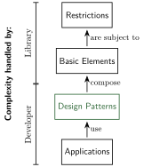

# Why use design patterns?

## Good reasons for using patterns in your code

Patterns have quite a lot of advantages for a software project. The following list is just a start

* **Reuse the proven solution** to common problems in software design
* **Facilitate understanding code** by breaking down the complexity of understanding software into separate concepts and their relation
* **Prevent bugs** that are hard and costly to find but commonly made
* **Favor sustainable software design**

## What exactly is a design pattern?

Reusable solution in form of a template.
Gets adapted to the problem
Flexible w.r.t specifics (language, context, content)

## How do they relate to software in general?
needs my definiton of application, library, developer, etc.

<figure markdown="span" style="width:50%">
{ width="100%" }
<figcaption>How much of the complexity in software is handled by whom</figcaption>
</figure>

<figure markdown="span" style="width:50%">
{ width="100%" }
<figcaption>Where do patterns help with software </figcaption>
</figure>

